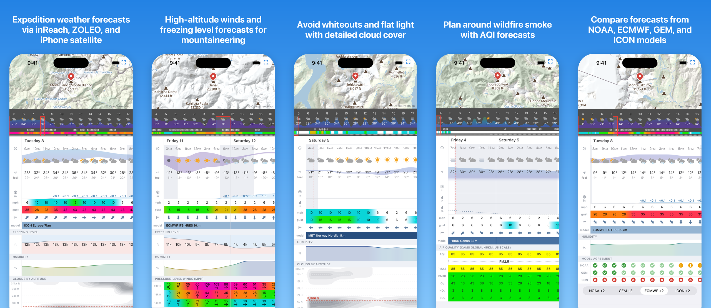

# Going Blue

Going Blue is a weather app designed specifically for satellite messengers. It was built for a Denali ski expedition with one goal: to get you all the weather information you would have at home, wherever you are. Going Blue uses a custom compression codec and decoder app to pack hundreds of forecast data points into a single message that can be sent over SMS, Garmin inReach, ZOLEO, or iPhone satellite messaging. Going Blue is deployed at [going.blue](https://going.blue/) and is available on the [App Store](https://apps.apple.com/app/id6798411927).



## How it works

1. Build a forecast request in the app. Choose the location, model, and variables that you care about.
2. Send the forecast request to Going Blue via the internet, SMS, Garmin inReach, ZOLEO, or iPhone satellite messaging.
3. Receive an encoded message from Going Blue. Paste it into the app to see a detailed forecast.

## Features

- Works via the internet, SMS, Garmin inReach, ZOLEO, and iPhone satellite messaging. 
- Uses a custom compression codec optimized for weather data that packs hundreds of data points into a single message. Choose between hourly detail and extended range up to 13 days.
- Temperature, snow, rain, wind, and cloud cover included by default. Optional variables include pressure-level winds for high-altitude mountaineering, AQI for planning around wildfire smoke, detailed cloud cover with 8 levels, and freezing level.
- Weather forecasts from over 30 models including HRRR (3km), HRDPS (2.5km), ICON-D2 (2km), and MET Norway (1km). Automatically chooses the best model for your location.
- Compare forecasts from American, Canadian, European, and German forecast centers.
- All forecasts are saved on your device for comparing multiple models and past forecasts.

## Architecture

There are a few components to the system:
1. Forecast source: [Open-Meteo](https://open-meteo.com/).
1. Going Blue service: handles incoming SMS, fetches forecasts from Open-Meteo, and replies with encoded forecasts.
1. Going Blue app: mobile app for creating forecast requests and decoding/visualizing forecast responses.

The service is written in TypeScript. There are four packages:
- `packages/protocol`: shared TypeScript binary encoding/decoding used by both the server and the mobile app.
- `packages/server` — Hono/Node.js server that receives inbound SMS messages, fetches forecasts from Open-Meteo, encodes messages using codec services, and sends replies. Also hosts the website.
- `packages/codec-server` — Codec server for encoding messages. Each codec version is deployed as a separate container so that old codecs can be frozen and maintained for clients on older versions.
- `packages/mobile` — Expo React Native app for building requests and visualizing forecasts.

## Compression

Going Blue uses a Markov model of weather combined with a [range Asymmetric Numeral Systems (rANS)](https://en.wikipedia.org/wiki/Asymmetric_numeral_systems) entropy coder. This is a similar entropy coder to what is used in modern compression codecs like [zstd](https://github.com/facebook/zstd) and [JPEG-XL](https://en.wikipedia.org/wiki/JPEG_XL).

### Entropy 

First, we need to define an important concept: entropy. [Entropy](https://en.wikipedia.org/wiki/Entropy_(information_theory)) is a measure of the average level of uncertainty in a system. It is defined as the sum of the probability of each symbol multiplied by the logarithm of its probability:

$$H(X) := -\sum_{x \in \mathcal{X}} p(x) \log_2 p(x)$$

Here we use a base-2 logarithm to measure entropy in bits (Shannon entropy).

Entropy depends on the probability distribution of symbols. For example, if we have two symbols that are equally likely (e.g. flipping a coin), then entropy is 1 bit:

$$H(\text{coin}) = -\left(\tfrac{1}{2} \log_2 \tfrac{1}{2} + \tfrac{1}{2} \log_2 \tfrac{1}{2}\right) = 1 \text{ bit}$$

If we have a coin that has two heads, the entropy is 0 since there is no uncertainty. 

$$H(\text{two-headed coin}) = -1 \log_2 1 = 0 \text{ bits}$$

Now, let's apply this to weather data with an example of encoding the weathercode, which is a general summary of weather conditions in a single symbol. There are 28 different weathercodes, so if weathercodes were uniformly distributed the entropy would be $\log_2 28 \approx 4.807 \text{ bits}$. Fortunately, weathercodes are not uniformly distributed:

| Weathercode | Probability |
|---|---|
| ☁️ overcast | **32.25%** |
| ☀️ clear sky | 31.13% |
| 🌤️ mainly clear | 9.52% |
| ⛅ partly cloudy | 7.73% |
| 🌦️ light drizzle | 7.38% |
| … everything else | 12.00% combined |

The actual entropy of the weathercode is about 2.69 bits, far below the uniform distribution. To decrease the entropy even more, we can take advantage of the fact that the current weather is a good predictor of future weather. We can model weather as a series of state transitions with different probabilities, i.e. a Markov chain ☀️ -> ☀️ -> ⛅ -> ⛅ -> 🌦️. If it is currently sunny, this is the probability distribution of the next hour's weather:

| Next hour | Probability |
|---|---|
| ☀️ clear sky | **85.40%** |
| 🌤️ mainly clear | 8.68% |
| ⛅ partly cloudy | 2.67% |
| ☁️ overcast | 2.58% |
| 🌦️ light drizzle | 0.458% |
| … everything else | 0.192% combined |

The entropy conditioned on the previous code is only 0.83 bits/symbol, 5.8x smaller than the uniform distribution!

### Huffman Coding

Now that we know the probability distribution and the entropy of the data, we can encode it. To start, we can use Huffman coding, which assigns codes to symbols based on their probability. More likely symbols get shorter codes, less likely symbols get longer ones, and the expected length of the code approaches the entropy of the data. 

| Weathercode | P | Bits | Huffman Code |
|---|---|---|---|
| ☀️ clear sky | 85.40% | 1 | `0` |
| 🌤️ mainly clear | 8.68% | 2 | `10` |
| ⛅ partly cloudy | 2.67% | 3 | `110` |
| ☁️ overcast | 2.58% | 4 | `1110` |
| 🌦️ light drizzle | 0.458% | 5 | `11110` |
| … everything else | 0.192% combined | 6+ | `111110…` |

In this example, the clear -> clear transition is very likely so it gets a 1-bit code: `0`. The clear -> light drizzle transition is unlikely, so it gets a 5-bit code: `11110`. The expected length of the encoded forecast is 1.25 bits/symbol, which is near the 0.83 bits/symbol entropy of the data. This is just the expected length, and the actual length can vary depending on the data. An all-clear forecast takes just 1 bit/symbol to encode while a forecast with rare weathercodes could take even more than 5 bits/symbol. 

### range Asymmetric Numeral Systems (rANS)

Huffman coding gets us near the entropy of the data, but it has a major flaw: each code takes at least one bit. Even though the entropy of weathercode is 0.83 bits/symbol, we can only reach 1.25 bits/symbol because of the one-bit floor.

To get around this limitation and get closer to the actual entropy of the data, Going Blue uses [rANS](https://en.wikipedia.org/wiki/Asymmetric_numeral_systems#Range_variants_(rANS)_and_streaming). 

The basic idea of rANS is to encode the data in a single large integer. Each integer is mapped to a symbol based on its probability distribution. The mapping is set up so that encoding a likely symbol requires a small increase in the number and encoding a rare symbol requires a large increase. 

Let's start with a simplified example. Say it is clear (`C`) 75% of the time and raining (`R`) 25% of the time. We can assign numbers to each state like this:

```
0  1  2  3  4  5  6  7  8  9  10 11 12 13 14 15 16 17 18 19 20 ...
   C  C  C  R  C  C  C  R  C  C  C  R  C  C  C  R  C  C  C  R  ...
```

When encoding a symbol from state `x`, we find the `x`th occurrence of that symbol. For example, if we start at state 1 with symbol `R`, we find the first occurrence of `R` which is 4. To encode `C` from state 4, we find the 4th occurrence of `C`, which is 5. If we encode another `R`, we find the 5th occurrence of `R`, which is 20. The message `RCR` can be represented as the number 20. 

To decode, we walk the process in reverse. At state 20, the symbol is `R` and it is the 5th `R`, so the previous state was 5. At state 5, the symbol is `C` and it is the 4th `C` so the previous state was 4. At 4, the symbol is `R` and it is the 1st `R` so the state goes to 1, which is the end of the message.

The reason rANS works is that encoding a symbol multiplies the state by roughly $1/p$. For symbol `R`, it multiplies the state by $1/(1/4) = 4$, which is about 2 bits. For `C`, it multiplies the state by $1/(3/4) = 4/3$, which is about 0.4 bits. 

rANS gets us very close to the actual entropy of the data. For a more detailed explanation of how rANS works, see this excellent [post](https://kedartatwawadi.github.io/post--ANS/).

For rANS and other entropy coders, both sides need to know the probability distribution of the data. The distributions are bundled into the app as part of each codec version. When the client makes its request, it sends a version at the beginning of the request and the server uses the corresponding distributions to encode the message.

### Entropy Reduction

rANS allows us to transmit data at close to its actual entropy. To further compress the data, we need to reduce its entropy.

There are several ways that we can do this. The first is quantization, or reducing the precision of each variable. Going Blue aims to preserve perceptible differences while not wasting bits on unnecessary precision. For example, temperature is transmitted at 1°C precision because it's unlikely that a difference of <1°C is going to change the decision a person makes based on the forecast. Wind is encoded using the [Beaufort scale](https://en.wikipedia.org/wiki/Beaufort_scale), which is tuned for noticeable differences in wind speed, e.g. Beaufort 1 "Direction shown by smoke drift but not by wind vanes" versus Beaufort 2 "Wind felt on face; leaves rustle; wind vane moved by wind".

For variables like snow and rain, which are sparse but have large variability, we use a sqrt scale. This provides detail at small amounts while preserving range for larger values. With rain, we might have an hour with 0.1mm rain and a 12 hour period with 100mm of rain. A sqrt scale allows us to represent both extremes on a scale with only 64 values. Rain values range from 0.036mm to 144mm and snow from 0.05cm to 200cm in a single time period.

```math
\begin{aligned}
\mathrm{encode:}\quad c &= \min\left(\left\lfloor 63\sqrt{\frac{v}{v_{\max}}} \right\rceil,\ 63\right) \\
\mathrm{decode:}\quad \hat{v} &= v_{\max}\left(\frac{c}{63}\right)^2
\end{aligned}
```

| Code      | 0 | 1     | 2     | 3     | …  | 16   | 32    | 48    | …  | 62     | 63     |
| --------- | -: | ----: | ----: | ----: | -: | ---: | ----: | ----: | -: | -----: | -----: |
| Rain (mm) | 0 | 0.036 | 0.145 | 0.327 | …  | 9.29 | 37.15 | 83.59 | …  | 139.47 | 144.00 |
| Step      | — | 0.036 | 0.109 | 0.181 | …  | 1.13 | 2.29  | 3.45  | …  | 4.46   | 4.54   |

For variables with large ranges, like temperature, we encode the starting temperature and then the delta of each forecast point. This avoids having a separate codebook for every possible temperature. It also allows the codec to more easily capture trends. For example, if the temperature rose 2°C in the last hour, it is likely still rising in the next hour. The delta provides more information about the next hour's temperature than the absolute temperature does.

We can also use correlation between variables to reduce entropy. Weathercode is great for this because it is always included and it is a summary of the weather. If the current weathercode is clear, it's probably not raining. We can split weathercodes into buckets (rainy, snowy, dry, etc.) and use that to condition the precipitation variables (snow, rain, precip chance). Variables that have diurnal cycles, like temperature, can be conditioned by the local time of day. If it's solar noon, the temperature is more likely to be rising. Forecast resolution (1h, 3h, 6h, 12h) is also used since the forecast resolution affects the amount of accumulation and magnitude of change in each period.

All of these refinements are chosen to make the distribution of each codebook as skewed as possible and thus decrease the entropy of the data. More refinements could be done, but there is a cost to having more codebooks and a smaller sample size for each codebook.

These are the units and techniques used for each variable:

| Variable                        | Model | Unit                                               | Codebook keyed by                                             |
| ------------------------------- | ----- | -------------------------------------------------- | ------------------------------------------------------------- |
| Weathercode                     | Value | WMO Code                                           | Previous weathercode                                          |
| Temperature                     | Delta | 1°C (-100°C to 155°C)                              | Previous temperature delta, time of day, forecast resolution  |
| Precip chance                   | Value | % in 8 steps                                       | Previous value, weathercode class, forecast resolution        |
| Snow                            | Value | cm, 64 sqrt-companded steps (0-200cm)              | Previous value bucket, weathercode class, forecast resolution |
| Rain                            | Value | mm, 64 sqrt-companded steps (0-144mm)              | Previous value bucket, weathercode class, forecast resolution |
| Freezing level                  | Delta | 1000ft steps (0-31,000ft)                          | Temperature delta bucket, forecast resolution                 |
| Cloud band                      | Value | % in 8 steps                                       | Previous value, pressure level                                |
| Wind gust                       | Delta | Extended Beaufort force (0-17)                     | Forecast resolution                                           |
| Surface wind speed              | Delta | Extended Beaufort force (0-17)                     | Wind gust delta, forecast resolution                          |
| Pressure-level wind speed       | Delta | Extended Beaufort force (0-17)                     | Pressure level, forecast resolution                           |
| Wind direction                  | Value | 8 cardinal directions                              | Previous direction, forecast resolution                       |
| AQI, Ozone, NO₂ (diurnal cycle) | Delta | Air quality index (US: 0-500, EU: 0-100), 25 bands | Previous delta, time of day, forecast resolution              |
| PM2.5, PM10, SO₂                | Delta | Air quality index (US: 0-500, EU: 0-100), 25 bands | Previous delta, forecast resolution                           |
| Dominant pollutant              | Value | Pollutant (PM2.5, PM10, Ozone, SO₂, NO₂)           | Previous dominant pollutant                                   |
| Model agreement                 | Value | 4 levels, strong disagreement to strong agreement  | Previous agreement, lead time                                 |

### Forecast Packing

Since Going Blue uses an entropy coder, the forecast length is not predictable. It depends on the entropy of the forecast, with stable (low-entropy) conditions taking few bits to encode and variable (high-entropy) conditions taking many bits to encode. In practice, forecasts with the default variable set range between 40 and 225 time periods, with an average near 100.

We can't promise a 3 day hourly forecast or a 10 day forecast at 3h resolution. At the minimum of 40 data points, we can choose between almost 2 days of hourly data or a 10 day forecast at 6h resolution. The app allows the user to select a fill priority: `detail`, `auto`, or `range`. The server fetches the forecast and then tries to fit as much data into the message as possible. At each step, it can either extend the range of the forecast (up to 13 days) or increase the detail (12h/6h/3h/1h resolution). The fill priority determines which it tries to do. These fill ladders are pre-defined and shared between the server and client. The server sends back a sequence number so that the client can derive the resolution of each forecast point. The server does a binary search of the sequence number to find the largest forecast that can fit within the character budget.

### Header Format

To keep the message small, the server never sends the client information that it already has. When the client creates a request, it stores request metadata like forecast location, model, variables, priority mode, UTC offset, and request time in a local cache. The client sends a request index to the server and the server sends that index back in the response. The client can then recover all of the forecast metadata from that index. Using this, the entire header can be packed into just 5 characters:

| Field     | Bits | Meaning                                                        |
| -------   | ---- | -------------------------------------------------------------- |
| `version` |    7 | base-85 index = protocol version; read before anything else    |
| `index`   |    7 | message index the client stores its request context under      |
| `seq`     |    8 | fill sequence number to derive forecast length and layout      |
| `elev`    |    7 | elevation in 100 m steps                                       |

### Alphabet and Message Length

SMS is the transport layer for Going Blue. Satellite messengers like Garmin inReach, iPhone, and ZOLEO can all send and receive messages via SMS. To reach Going Blue, a message travels through several intermediaries. For example, the path an inReach message takes looks something like this:

```
inReach -Iridium Short Burst Data (SBD)-> Garmin -SMS-> Twilio -HTTP-> Going Blue server
```

Each part of the chain has a different character set and message length limit. In the case of Garmin, these are:
 - Iridium SBD: 270-340 bytes
 - SMS: 160 GSM-7 basic septets
 - Garmin: 160 characters of printable ASCII

The alphabet that Going Blue can use is the intersection of all of these: 160 characters of GSM-7 basic ∩ printable ASCII (minus space), or base-85. This provides log₂(85) ≈ 6.409 bits per character and approximately 1025 bits per message.

Each device has a different character set and message length. Going Blue chooses how to encode a message based on the device:

| Device | Network | Alphabet[^1] | Message length | Bits per message |
|---|---|---|---|---|
| SMS | Cellular | base-124 (GSM-7 basic) | 160 chars | ~1110 |
| Garmin inReach | Iridium Short Burst Data | base-85 (GSM-7 basic ∩ printable ASCII) | 160 chars | ~1025 |
| ZOLEO | Iridium Short Burst Data | base-85 (GSM-7 basic ∩ printable ASCII) | 240 chars | ~1538 |
| iPhone satellite messaging | Globalstar | base-32768 | 50 chars[^2] | ~707 |
| Internet | Internet | base-94 (printable ASCII) | — | — |

[^1]: Space is not included in any alphabet.
[^2]: iPhone satellite messages are capped at the minimum of 70 UTF-16 code units or 140 bytes of compressed UTF-8. In practice, the header is 5 ASCII characters and the remaining budget is 45 base-32768 characters (3 bytes each), which is 50 characters total.

### Data Source

Entropy coding requires having accurate statistics about the distribution of each symbol since sequences that aren't represented in the training data will be very expensive to encode. For example, if we trained the codebooks only on tropical weather forecasts, the encoder would assign very long symbols to snow and a forecast in the arctic would be very expensive.

The encoder is trained on over 100k historical forecasts collected from the [Open-Meteo Historical Forecast API](https://open-meteo.com/en/docs/historical-forecast-api). These forecasts are sampled from 10,000 locations across the world. Forecast locations are not uniformly sampled across the globe since that would bias the forecasts strongly towards the ocean. Instead, the forecast points are allocated based on 30 Köppen climate classes in proportion to the square-root of the area of the climate class. This ensures that rare climate classes have enough training data while still allocating more share to more common climate types. 

Ocean locations are not included in Köppen but they are included in the training data with an 85/15 land/ocean split. This gives the ocean a similar weight to a high-level Köppen climate class (tropical, arid, temperate, continental, polar). Ocean locations are sampled from 6 30° latitude bands with the same `sqrt(area)` allocation as climate classes.


    
Training data is pulled from the two year window July 2024 - July 2026. 12 14-day forecasts are collected for each location for an average of 1 forecast every 2 months. This ensures coverage of all seasons while also reducing forecast duplication.

### Evaluation

1,500 forecast locations are held out for evaluation and never used to train the encoder. 137 of my Windy favorites are also used as an evaluation set since these are the places I actually want weather forecasts for. There is also a small set of 150 peaks used in evaluation to make sure that Going Blue works well in the mountains. There is a custom page for exploring the evaluation results at [going.blue/benchmark](https://going.blue/benchmark).

Fill percentage is the main codec performance metric. 100% represents a forecast filled to maximum range and resolution (13 days, hourly data). Encoding improvements should increase this percentage. 

Some interesting findings from the evaluation:
1. The median forecast with auto priority has a 13 day range with 2 days at hourly resolution, 5 days at 3h, 3 days at 6h, and the last 3 days at 12h. The 1st-percentile forecast still has 11 days of data with 1 day hourly, 4 days at 3h, and 6 days of 12h.
1. Forecasts in polar climates (Köppen class E and ocean at 60°-90°N) are the cheapest to encode. Probably because of the polar high and lack of diurnal temperature swings.
1. Forecasts in tropical climates (Köppen class A) are the most expensive to encode. Probably because of frequent afternoon precipitation, strong diurnal temperature swings, etc. There's a lot more weather happening in the tropics than there is in the arctic.
1. Ocean forecasts are cheaper than every climate class except the arctic. There are no diurnal temperature swings over open water and winds are more consistent than they are on land. 
1. Wind is the most expensive variable (steady, gust, direction combined) taking an average of 40.1% of the message. Temperature is the second most expensive at 24.6% followed by weathercode at 19%. Since snow and rain are sparse, they only take up an average of 10.8% combined. 
1. A 1st-percentile forecast containing all optional variables (detailed clouds, high altitude winds, freezing level, and precip chance) still delivers 7 days of forecast data at 6h resolution for 3 days and 12h resolution for the next 4 days.

### Weather Data & Transformation

Going Blue uses [Open-Meteo](https://open-meteo.com/) for weather data with some transformations that are explained below.

#### Elevation Correction for Temperature and Precipitation

Open-Meteo accepts an elevation parameter for forecasts and adjusts temperature from the model's grid cell elevation using temperature lapse rate. It does not adjust other variables like precipitation type. This can lead to contradictory forecasts in the mountains. For example, a forecast for the summit of Denali may show very low temperatures and rain if it is raining at the grid cell elevation (~3000m for GFS). 

To fix this, rain is remapped to snow if the forecast elevation is above the freezing level. It is also remapped to snow if the temperature is below -2°C to handle inversions and forecast centers that do not support freezing level (GEM, ECMWF). Snow is never remapped to rain. Rain is translated to snow at a 7:1 SWE ratio for parity with Open-Meteo. More accurate snow:liquid mapping may be added in the future.

The following weathercodes are remapped:
 - 51/53/55 (drizzle)        → 71/73/75 (snow)
 - 61/63/65 (rain)           → 71/73/75 (snow)
 - 80/81/82 (rain showers)   → 85/85/86 (snow showers)

Freezing drizzle (56/57) and freezing rain (66/67) are not transformed.

#### Pressure-level Cloud Interpolation

Open-Meteo provides cloud cover at various pressure levels. This is calculated based on the relative humidity compared to the critical relative humidity at each pressure level using Sundqvist's formula. The pressure-level cloud data drives the detailed cloud view in the meteogram, which shows clouds at 8 different levels in the atmosphere. This information can help determine what type of clouds are forecast: high cirrus overcast, a lenticular on the summit, or valley fog?

There is a subtle problem with using clouds at each pressure level directly: the pressure-level variable only reports clouds that are exactly at that band. If there is a cloud at 20k but we only pull the 18k and 24k bands, we will miss that cloud entirely. This can lead to inconsistent forecasts where we report "cloudy" in the weathercode but the meteogram shows no clouds. 

To fix this, Going Blue attributes low (<3km), mid (3-8km), and high (>8km) cloud cover to their respective pressure levels. The low, mid, and high cloud cover variables are derived from the tens to hundreds of pressure levels within each model, so there are no gaps.

First, each pressure level is associated with a band using geopotential heights. For example:
 - Low (<3km): 1000, 925, 850 hPa
 - Mid (3-8km): 700, 600, 500, 400 hPa
 - High (>8km): 300 hPa

If the band reports clouds but none of its member levels do, the member levels are assigned clouds based on their relative humidity. Clouds from the low/mid/high band are split between the levels in the band whose humidity is furthest above critical relative humidity. 

#### Weathercode Summarization

Open-Meteo is an hourly weather API but Going Blue forecast periods range from 1h to 12h. Going Blue summarizes the hourly weathercodes of a period in a single weathercode for the period. Showery codes are used to represent mixed conditions. For example, if it snows 3 hours in a 12h period and is sunny the remaining 9 hours, a "snow showers" code will be used. 

Open-Meteo does not emit mixed rain/snow weathercodes. Going Blue uses a mixed code if the water equivalent of the lesser type of precipitation exceeds 25% of the total precipitation. For example, in a period with 1" of snow (~0.14" water equivalent) and 0.1" of rain, rain accounts for 42% of the precip so it gets a mixed code. With 1" of snow and 0.01" of rain, rain is just a trace at 7% of total precip and the snow code is used.

#### Air Quality

Air quality is sourced from the CAMS model which has 11km resolution in Europe and 44km resolution in the rest of the world. The US and Europe have separate air quality scales that have different weights and health thresholds for each pollutant. Both scales calculate the index of each constituent pollutant and then take the maximum index as the headline AQI. The constituent pollutants are:
 - PM2.5 (smoke)
 - PM10 (dust)
 - Ozone (smog)
 - Nitrogen Dioxide (traffic)
 - Sulfur Dioxide (industrial/volcanic)
 - Carbon Monoxide (US only)

In practice, PM2.5 and ozone drive the headline AQI with PM10 a distant third. The other pollutants are rarely the main concern. Dominant pollutant frequency by scale:
 - American scale: PM2.5 56.9%, Ozone 40.3%, PM10 2.8%
 - European scale: PM2.5 23.1%, Ozone 68.6%, PM10 8.3%

Because of this, the headline AQI can be derived from other pollutants if they are already present in the message. If at least PM2.5 and ozone are present, just the residual between the estimated AQI and the actual AQI is sent. The residual is almost nothing (~0.036 bits/period) if PM2.5, ozone, and PM10 are already in the message. With PM2.5 and ozone, the headline AQI only costs 0.275 bits/period on the American scale and 0.653 bits/period on the European. This is significantly cheaper than encoding headline AQI without the constituent variables, which costs roughly 1 bit/period.

Going Blue reports the headline AQI in addition to the dominant pollutant. It can also report the index of any individual pollutant with the exception of Carbon Monoxide, which is US-only and rarely a problem. 

#### Model Agreement

Going Blue computes a model agreement score that indicates how well the current forecast agrees with the American, Canadian, European, and German centers. This is useful for judging forecast confidence.

An agreement score is calculated for each forecast center. The score has 4 levels from 0 (strong disagreement) to 3 (strong agreement). Agreement takes into account temperature, precipitation, and wind. For each variable, the agreement is calculated as a score between 0 (disagreement) and 1 (agreement) like this:
1. **Temperature**: Absolute difference in °C. Identical temperatures score 1, with a linear scale to total disagreement at 5 °C difference.
2. **Wind**: Speed is converted to a continuous Beaufort force. Less than 0.5 force difference is 1 with a linear scale to total disagreement at a 3 force difference. Direction is also used if both models report a force of at least 2, since direction means little at low wind speeds. For direction, agreement is a cosine scale from 0° to 180°. The minimum score of direction and speed is used as the total wind score.
3. **Precipitation**: Precipitation is scored on total water equivalent, combining rain and snow. A period is considered wet if the amount of liquid exceeds a trace amount. If both models report dry, the score is 1. If both report wet, the amounts `a` and `b` are scored like `sqrt(min(a, b) / max(a, b))` so that equal amounts are scored as 1 and large differences approach 0. If one model reports wet and one reports dry, the agreement score ranges from 0.55 (one model dry, one model at trace precip) to 0 (one model dry, one model with significant precip). 

The components are combined using a weighted soft min with precip at 60%, wind at 30%, and temperature at 10%.

The combined agreement score (0 to 1) is then mapped to an agreement level: strong disagreement, weak disagreement, weak agreement, strong agreement. The thresholds are chosen to roughly align to quartiles of actual agreement scores calculated from live forecasts.

## Development

Requirements:
1. Docker
2. tmux

Everything needed to run locally is bundled into one tmux session:

```
pnpm install
./dev.sh
./dev.sh kill
```

The services run on the following ports by default:
 - Postgres: 5432
 - Gateway server: 8080
 - Codec server: 8082
 - Expo (mobile app server): 8081

### iOS App

To run the iOS app:

```
cd packages/mobile
eas build -p ios --profile development
```

Then install the app on your iOS device using the QR code in the step above.

The app can also be run in the simulator:

```
cd packages/mobile
npx expo run:ios
```

For a non-development build:

```
eas build --platform ios --profile preview
```

### Tests

```bash
pnpm test
```

### Codec Versioning

The Going Blue codec relies on the client and server having identical codebooks. Since clients may be out of service and unable to update for long periods of time, the service maintains support for old versions. Each forecast request starts with a version number e.g. `v1`. The gateway server routes each message to the appropriate codec service. Each version of the codec is a separate container running from `main` tagged at a specific version. Golden messages are kept for each codec version so that changes to the codec service can be made (for example patching security vulnerabilities) while ensuring that the message format does not change. This approach allows the codec to evolve quickly without sacrificing support for older clients in the field.

#### Codec v2 (App version 1.1.0)

 - Added air quality variables: AQI, PM2.5, PM10, ozone, nitrogen dioxide, sulfur dioxide. Supports both American and European scales. 
 - Added support for iPhone satellite messaging with multi-part messages.
 - Corrected precipitation type for elevation. Open-Meteo already adjusts temperature from grid cell elevation to forecast elevation using a temperature lapse rate formula. This change also remaps rain to snow when the forecast elevation is above the freezing level or the temperature is less than -2°C. Uses a 7:1 snow:liquid ratio. Weathercode is also remapped.
 - Improved weathercode aggregation to better summarize mixed conditions. 
 - Added model attribution to the meteogram so that the switch between a high-resolution local model and a low-resolution global model is clear.
 - Expanded SMS alphabet from 85 to 124 characters by using almost all of GSM-7 instead of the intersection of GSM-7 and ASCII.

#### Codec v3 (App version 1.2.0)

 - Added ZOLEO support with 240 character messages (up from 160 on SMS/Garmin).
 - Added Garmin Messenger support for newer inReach devices.
 - Expanded support for multi-message forecasts from iPhone to all devices.
 - Expanded detailed cloud cover from 3 to 8 levels and improved detailed cloud rendering in the meteogram.
 - Expanded pressure-level winds from 3 to 7 levels.
 - Added a floating legend to the meteogram.
 - Split out rain, snow, and precip chance in the meteogram to improve legibility.
 - Added support for mixed rain/snow weathercodes when there is a substantial amount of each precip type.
 - Improved meteogram rendering speed.
 - Added offline maps with downloadable region packs. 
 - Added more options to the unit selector.
 - Merged Builder and Decoder tabs into a single page.

#### In development: Codec v4 (App version 1.3.0)

 - Added Android support. 
 - Added a model agreement score for judging forecast confidence.
 - Added a model comparison switch. 

## License

Copyright 2025-2026 Lane Aasen

Licensed under the [Apache License, Version 2.0](LICENSE). You may use, modify, and distribute this
software, including commercially, provided you retain the copyright and license notices and state
any significant changes you make. The license includes an express patent grant. See [NOTICE](NOTICE)
for the required attribution notice.

Forecast data comes from [Open-Meteo](https://open-meteo.com/) via its public API and is subject to
Open-Meteo's own terms; no Open-Meteo source code is included here.
