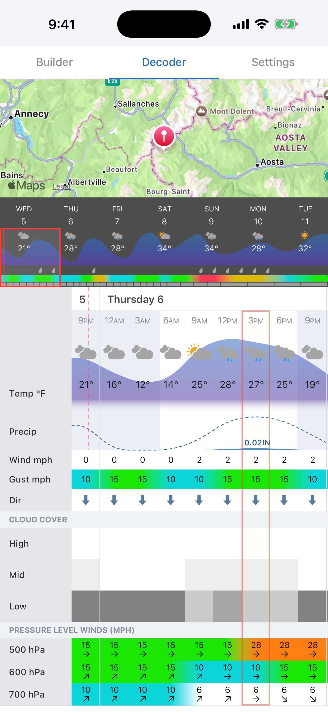

# Going Blue

Going Blue is a weather app designed specifically for satellite messengers. It was built for a Denali ski expedition with one goal: to get you all the weather information you would have at home, wherever you are. Going Blue uses a custom compression codec and decoder app to pack hundreds of forecast data points into a single 160-character message. Going Blue is deployed at [going.blue](https://going.blue/).



## How it works

To use Going Blue, a user:
1. Creates a forecast request in the app, specifying location, weather model, and weather variables.
1. Sends the forecast request to Going Blue over the internet, SMS, or satellite messenger like Garmin inReach or ZOLEO.
1. Receives an encoded forecast.
1. Pastes the encoded forecast into the app to visualize the forecast.

## Architecture

There are a few components to the system:
1. Forecast source: [Open-Meteo](https://open-meteo.com/) which provides all forecast data.
1. Going Blue service: handles incoming SMS, fetches forecasts from Open-Meteo, and replies with encoded forecasts.
1. Going Blue app: mobile app for creating forecast requests and decoding/visualizing forecast responses.

The service is written in TypeScript. There are four packages:
- `packages/protocol` — shared TypeScript binary encoding/decoding used by both the server and the mobile app.
- `packages/server` — Hono/Node.js server; receives inbound messages, fetches forecasts, and sends replies.
- `packages/codec-server` — Codec server for encoding messages. This is separate from the main server so that old codecs can be kept deployed as-is while the codec is modified.
- `packages/mobile` — Expo React Native app for building requests and decoding forecasts.

## Compression

Going Blue uses a Markov model of weather combined with a [rANS](https://en.wikipedia.org/wiki/Asymmetric_numeral_systems) entropy coder.

### Markov Model

To see how this works, let's step through an example of encoding the weathercode, which is a general summary of weather conditions in a single symbol. There are 28 different weathercodes, so encoding weathercode without compression would take 5 bits. We can take advantage of the fact that the current weather is a good predictor of future weather. For example, if it is currently sunny, this is the probability distribution of the next hour's weather:

| Next hour | Probability |
|---|---|
| ☀️ clear sky | **85.40%** |
| 🌤️ mainly clear | 8.68% |
| ⛅ partly cloudy | 2.67% |
| ☁️ overcast | 2.58% |
| 🌦️ light drizzle | 0.458% |
| … everything else | 0.192% combined |

We can then represent a forecast as series of state transitions with different probabilities i.e. a Markov chain: ☀️ -> ☀️ -> ⛅ -> ⛅ -> 🌦️.

### Entropy Coding

We can then feed this probability distribution into an entropy coder like a Huffman coder. In Huffman coding, each symbol is assigned a code based on its probability. The more likely a symbol is, the shorter its code:

| conditions | P | bits | code |
|---|---|---|---|
| ☀️ clear sky | 85.40% | 1 | `0` |
| 🌤️ mainly clear | 8.68% | 2 | `10` |
| ⛅ partly cloudy | 2.67% | 3 | `110` |
| ☁️ overcast | 2.58% | 4 | `1110` |
| 🌦️ light drizzle | 0.458% | 5 | `11110` |
| … everything else | 0.192% combined | 6+ | `111110…` |

In this example, the clear -> clear transition is very likely so it gets a 1-bit code: `0`. The clear -> light drizzle transition is unlikely, so it gets a 5-bit code: `11110`. The expected length of the encoded forecast is only 1.248 bits/symbol, far below the 5 bits/symbol that would be required to encode any of the 28 different weathercodes. The actual encoded length may vary depending on the forecast. If it's completely clear for the entire forecast period, we will just use 1 bit per period. In more variable conditions, we will need more bits for each forecast period.

The actual entropy coder that Going Blue uses is [rANS](https://en.wikipedia.org/wiki/Asymmetric_numeral_systems#Range_variants_(rANS)_and_streaming) which removes the 1-bit floor of Huffman coding by encoding the entire forecast into a single large number instead of going symbol by symbol. See this [post](https://kedartatwawadi.github.io/post--ANS/) for a great explanation of asymmetric numeral systems. With the Huffman coder, we can reach 1.248 bits/symbol. rANS brings us much closer to actual entropy of the data, which is 0.833 bits/symbol.

### Cross-Variable Correlation

The same technique can be applied to other weather variables. Correlation between variables can also be used. For example, weathercodes are split into classes that give a general weather bucket: rainy, snowy, dry, etc. Weathercode is always included so this data can be used to condition other variables for free. Snow, rain, and precipitation probability are keyed off of weathercode class.

### Delta Encoding

For variables with large ranges, like temperature, we encode the starting temperature and then the delta of each forecast point. This avoids having a separate codebook for every possible temperature. It also allows the codec to more easily capture trends. For example, if the temperature rose 2°C in the last hour, it is likely still rising in the next hour. The delta provides more information about the next hour's temperature than the absolute temperature does.

### Sqrt Scale for Large Ranges

For variables like snow and rain which are sparse but have large variability, we use a sqrt scale. This provides detail at small amounts while preserving range for larger values. With rain, we might have an hour with 0.1mm rain and a 12 hour period with 100mm of rain. A sqrt scale allows us to represent both extremes on a scale with only 64 values. Rain values range from 0.036mm to 144mm and snow from 0.05cm to 200cm in a single time period.

```math
\begin{aligned}
\mathrm{encode:}\quad c &= \min\left(\left\lfloor 63\sqrt{\frac{v}{v_{\max}}} \right\rceil,\ 63\right) \\
\mathrm{decode:}\quad \hat{v} &= v_{\max}\left(\frac{c}{63}\right)^2
\end{aligned}
```

| Code      | 0 | 1     | 2     | 3     | …  | 16   | 32    | 48    | …  | 62     | 63     |
| --------- | -: | ----: | ----: | ----: | -: | ---: | ----: | ----: | -: | -----: | -----: |
| Rain (mm) | 0 | 0.036 | 0.145 | 0.327 | …  | 9.29 | 37.15 | 83.59 | …  | 139.47 | 144.00 |
| Step      | — | 0.036 | 0.109 | 0.181 | …  | 1.13 | 2.29  | 3.45  | …  | 4.46   | 4.54   |

### Forecast Packing

Going Blue uses an entropy coder which means that the forecast length is not predictable. It depends on the entropy of the forecast, with stable (low-entropy) conditions taking few bits to encode and variable (high-entropy) conditions taking many bits to encode. In practice, forecasts with the default variable set range between 40 to 225 time periods, with an average near 100.

We can't promise a 3 day hourly forecast or a 10 day forecast at 3h resolution. At the minimum of 40 data points, we can choose between almost 2 days of hourly data or a 10 day forecast at 6h resolution. The app allows the user to select a fill priority: `detail`, `auto`, or `range`. The server fetches the forecast and then tries to fit as much data into the message as possible. At each step, it can either extend the range of the forecast (up to 13 days) or increase the detail (12h/6h/3h/1h resolution). The fill priority determines which it tries to do. These fill ladders are pre-defined and shared between the server and client. The server sends back a sequence number so that the client can derive the resolution of each forecast point. The server does a binary search of the sequence number to find the largest forecast that can fit within the character budget.

### Header Format

To keep the message small, the server never sends the client information that it already has. When the client creates a request, it stores request metadata like forecast location, model, variables, priority mode, UTC offset, and request time in a local cache. The client sends a request index to the server and the server sends that index back in the response. The client can then recover all of the forecast metadata from that index. Using this, the entire header can be packed into just 5 characters:

| Field   | Bits | Meaning                                                        |
| ------- | ---: | -------------------------------------------------------------- |
| version |  7 | base-85 index = protocol version; read before anything else |
| `index`  |    7 | message index the client stores its request context under        |
| `seq`   |    8 | fill sequence number to derive forecast length and layout |
| `elev`  |    7 | elevation in 100 m steps                                          |
| `class` |    3 | which of the 8 codebook classes the body used                   |

### Strategy by Variable

Each variable has a different quantization method and codebook strategy. The variables that are always included are:
1. Weathercode
2. Temperature
3. Snow
4. Rain
5. Wind gust
6. Wind speed
7. Wind direction

| Variable             | Model | States (the symbol alphabet)                          | Codebook keyed by                              | Quantization                          |
| -------------------- | ----- | ------------------------------------------------------ | ---------------------------------------------- | ------------------------------------- |
| weathercode          | value | 28 WMO codes                                            | previous code                                  | —                                     |
| temperature          | delta | Δ°C −7…+7, plus an escape symbol + raw 6-bit (−32…+31) | resolution × time-of-day (8 × 3h local buckets) × previous-delta bucket (≤−2 \| −1 \| 0 \| +1 \| ≥+2) | 1 °C steps, −100…+155 °C; 8-bit anchor |
| precipitation prob.  | value | eighths 0…7                                             | resolution × previous value × same-period weathercode class | 0–100% in eighths        |
| snow                 | value | 64 companded steps                                      | resolution × previous-value bucket (0 \| 1–3 \| 4–9 \| 10–20 \| 21+) × same-period weathercode class | sqrt-companded, 0–200 cm |
| rain                 | value | 64 companded steps                                      | resolution × previous-value bucket (same) × same-period weathercode class | sqrt-companded, 0–144 mm |
| freezing level       | delta | Δ −31…+31                                               | resolution × same-period temperature Δ bucket (≤−2 \| −1 \| 0 \| +1 \| ≥+2); resolution alone when temp is absent | 1000 ft steps, 0–31000 ft; 5-bit anchor |
| cloud (high/mid/low) | delta | Δ −7…+7                                                 | one shared table per level                     | 0–100% in eighths; 3-bit anchor       |
| wind gust            | delta | Δ −17…+17                                               | resolution (encodes first, no context of its own) | extended Beaufort force 0…17, km/h bands; 5-bit anchor |
| wind speed           | delta | Δ −17…+17                                               | resolution × level; surface by the gust column's Δ bucket; 600/700 hPa by the upper level's Δ bucket | extended Beaufort force 0…17, km/h bands (midpoint decode); 5-bit anchor |
| wind direction       | value | 8 cardinals                                             | resolution × previous direction (× upper direction for 600/700 hPa); calm periods emit no symbol | 45° points |

### Alphabet

Going Blue transmits messages over SMS. Satellite messengers like Garmin inReach and ZOLEO can send messages to the number over SMS. The path a message takes from a satellite messenger like inReach looks something like this:

```
inReach -iridium-> garmin -sms-> twilio -http-> going blue
```

Each layer of the transport uses a different encoding that can transform or split a message. SMS uses a [GSM-7](https://en.wikipedia.org/wiki/GSM_03.38) alphabet with 7 bits per character. Garmin apps only support printable ASCII. Going Blue uses the intersection of printable ASCII and GSM-7 basic minus the space character for a base-85 alphabet. This provides log₂(85) ≈ 6.409 bits per character.

```
!"#$%&'()*+,-./0123456789:;<=>?@ABCDEFGHIJKLMNOPQRSTUVWXYZ_abcdefghijklmnopqrstuvwxyz
```

### Data Source

Entropy coding requires having an accurate statistics about the distribution of each symbol since sequences that aren't represented in the training data will be very expensive to encode. For example, if we trained the codebooks only on tropical weather forecasts, the encoder would assign very long symbols to snow and a forecast in the arctic would be very expensive.

The encoder is trained on over 100k historical forecasts collected from the [Open-Meteo Historical Forecast API](https://open-meteo.com/en/docs/historical-forecast-api). These forecasts are sampled from 8,500 locations across the world. Forecast locations are not uniformly sampled across the globe since that would bias the forecasts strongly towards the ocean. Instead, the forecast points are allocated based on 30 Köppen climate classes based on the square-root of the area of the climate class. This ensures that rare climate classes have enough training data while still allocating more share to more common climate types. 

Ocean locations are not included in Köppen but they are included in the training data with a 85/15 land/ocean split. This gives the ocean a similar weight to a high-level Köppen climate class (tropical, arid, temperate, continental, polar). Ocean locations are sampled from 6 30° latitude bands with the same `sqrt(area)` allocation as climate classes.


    
Training data is pulled from the two year window July 2024 - July 2026. 12 14-day forecasts are collected for each location for an average of 1 forecast every 2 months. This ensures coverage of all seasons while also reducing forecast duplication.

### Evaluation

1,500 forecast locations are held out for evaluation and never used to train the encoder. 137 of my Windy favorites are also used as an evaluation set since these are the places I actually want weather forecasts for. There is also a small set of 150 peaks used in evaluation to make sure that Going Blue works well in the mountains. There is a custom page for exploring the evaluation results at [going.blue/benchmark](https://going.blue/benchmark).

Fill percentage is the main codec performance metric. 100% represents a forecast filled to maximum range and resolution (13 days, hourly data). Encoding improvements should increase this percentage. 

Some interesting findings from the evaluation:
1. The median forecast with auto priority has a 13 day range with 2 days at hourly resolution, 5 days at 3h, 3 days at 6h, and the last 3 days at 12h. The 1st-percentile forecast still has 10 days of data with 1 day hourly, 4 days at 3h, and 6 days of 12h.
1. Forecasts in polar climates (Köppen class E and ocean at 60°-90°N) are the cheapest to encode. Probably because of the polar high and lack of diurnal temperature swings.
1. Forecasts in tropical climates (Köppen class A) are the most expensive to encode. Probably because of frequent afternoon precipitation, strong diurnal temperature swings, etc. There's a lot more weather happening in the tropics than there is in the arctic.
1. Ocean forecasts are cheaper than every climate class except the arctic. There are no diurnal temperature swings over open water and winds are more consistent than they are on land. 
1. Wind is the most expensive variable (steady, gust, direction combined) taking an average of 40.1% of the message. Temperature is the second most expensive at 24.6% followed by weathercode at 19%. Since snow and rain are sparse, they only take up an average of 10.8% combined. 
1. A 1st-percentile forecast containing all optional variables (detailed clouds, high altitude winds, freezing level, and precip chance) still delivers 7 days of forecast data at 6h resolution for 3 days and 12h resolution for the next 4 days.

## Development

Requirements:
1. Docker
2. tmux

Everything needed to run locally is bundled into one tmux session:

```
pnpm install
./dev.sh
./dev.sh kill
```

The services run on the following ports by default:
 - Postgres: 5432
 - Gateway server: 8080
 - Codec server: 8082
 - Expo (mobile app server): 8081

### iOS App

To run the iOS app:

```
cd packages/mobile
eas build -p ios --profile development
```

Then install the app on your iOS device using the QR code in the step above.

The app can also be run in the simulator:

```
cd packages/mobile
npx expo run:ios
```

For a non-development build:

```
eas build --platform ios --profile preview
```

### Tests

```bash
pnpm test
```

## License

Copyright 2025-2026 Lane Aasen

Licensed under the [Apache License, Version 2.0](LICENSE). You may use, modify, and distribute this
software, including commercially, provided you retain the copyright and license notices and state
any significant changes you make. The license includes an express patent grant. See [NOTICE](NOTICE)
for the required attribution notice.

Forecast data comes from [Open-Meteo](https://open-meteo.com/) via its public API and is subject to
Open-Meteo's own terms; no Open-Meteo source code is included here.
